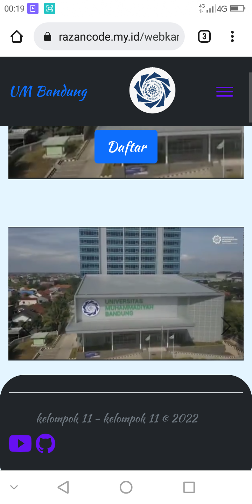
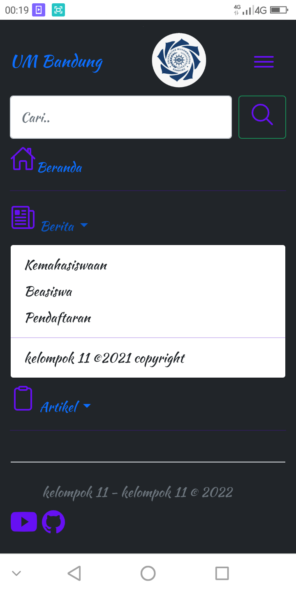
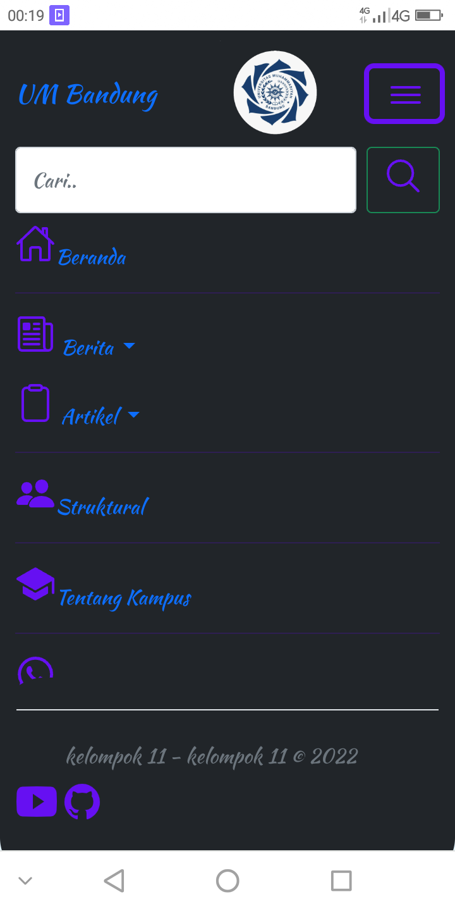

# webberita

Sebuah contoh web portal berita dengan menggunakan html dan CSS bootstrap
silahkan dicoba 

#Update
- dilengkapi Panel Admin
- 
- proses pengerjaan

- 📱RESPONSIVE📱
- 🖥️ || Mudah digunakan
- 🖥️ || bagus utk pemula web 
- 🖥️ || coding yang mudah dipahami

# Preview
-  

-  

- 

# Tutorial Instalasi?
- 1. Siapkan Apache Server (XAMPP atau Awebserver)
- 2. Siapkan Code editor/ Text Editornya

- 3. Download file Zip Klik ==> [@download..!!](https://github.com/muhammadrazan999/webberita/archive/refs/heads/main.zip)
- 4. ekstrak => jalankan Server => selesai
- 5. Tunggu Info update lebih lanjut Yach 

# selamat mencoba
- 

